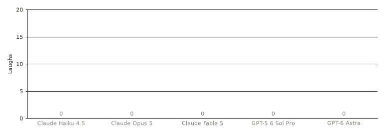

# LaughBench

A benchmark that asks one question of an AI model: **can it make a human
actually laugh?**

LaughBench is a benchmark for evaluating large language models on humor generation, using human laughter as the ground-truth signal. Models are prompted to produce original jokes relating to news articles, and human raters report a binary outcome: whether or not the joke elicited genuine laughter.

**Motivation.** Humor generation is hypothesized to be gated by general intelligence. Empirically, joke-writing ability correlates with cognitive ability in humans; successful professional comedians, whose careers depend almost entirely on generating laughter, are observed to have well-above-average IQs. Theoretically, humor is thought to have evolved as a reward signal for detecting faulty assumptions in one's predictive model of the world. Inducing laughter therefore requires a model to simulate another mind, anticipate the false inference that mind will draw, and possess the underlying truth it will miss. This is a demanding exercise in theory of mind and world modeling.

**Design rationale**. LaughBench offers two advantages over existing evaluation paradigms:
1. Objective signal on a creative task: Unlike open-ended tasks such as research synthesis, poetry, or story generation, where quality judgments are diffuse and contested, LaughBench yields a crisp, binary outcome: the human either laughed or did not. The rater cannot talk themselves into thinking output is more intelligent than it is.
2. Resistance to template-matching: Unlike many coding and mathematics benchmarks, solutions cannot be assembled from memorized problem shapes or general-purpose strategies. Producing a genuinely funny joke about a given subject requires discovering a novel, subject-specific connection. A generic joke retargeted at a new topic (e.g., a stock forest-fire joke applied to a fire in France) is readily identified as such by human raters.

## How it works

The model sees a fresh news story (headline plus the first five paragraphs) and
writes one short joke about it. A human reads the story, then the joke, and
records what actually happened.

Novelty is enforced twice over. Articles must postdate the model's training
cutoff, and the model gets no tools or web access. The model will not have access to information or existing jokes about the news event. The rating then separates jokes that
landed *because of this event's specifics* from generic material that merely
happened to fit.

## Scoring

Each joke gets one rating:

- **(a)** didn't laugh
- **(b)** laughed, but the joke is generic — it could have existed before the event
- **(c)** laughed, and the joke is likely new and original

**Score = fraction of attempts rated (c).**

**Refusals are failures.** "I refuse to joke about that" is a legitimately
unfunny response. The task was to be funny, and it wasn't, so it counts in
the denominator at zero credit, same as a joke nobody laughed at. Empty
replies are recorded as refusals automatically; verbal refusals get rated (a)
by the human. Events relating to tragedies are nevertheless filtered before 
joke generation to mitigate this issue.

## Example results



One run, one rater (the author), five models:

| Model | Score |
|---|---|
| Claude Haiku 4.5 | 0/10 |
| Claude Opus 5 | 0/10 |
| Claude Fable 5 | 0/10 |
| GPT-5.6 Sol Pro | 0/10 |
| GPT-6 Astra | 0/20 |

No model produced a single laugh. GPT-5.6 Sol Pro, GPT-6 Astra, and Fable each managed a smile or two, which the smaller models never did.

## Setup

No dependencies — plain Python 3.

```sh
cp .env.example .env   # then add your OpenRouter API key
```

## Run

```sh
# 1. Fetch articles published after the model's training cutoff.
#    Each headline gets screened interactively (y/n) to exclude tragedies.
python fetch_articles.py --cutoff 2026-03-01 --limit 20

# Or pull from specific sections instead of general news:
python fetch_articles.py --cutoff 2026-03-01 --sections science,tech,business
# available: news, world, politics, business, tech, science, health, culture, sport

# 2. Generate one joke per article (no tools, no web access,
#    reasoning effort pinned to high for all models).
python generate_jokes.py --model anthropic/claude-opus-4.8

# 3. Rate: read the story, hit ENTER, read the joke, answer a/b/c.
python rate.py

# 4. Score.
python score.py
```

Data lives in three JSONL files (`articles.jsonl`, `jokes.jsonl`,
`ratings.jsonl`). Every step skips work it has already done, so re-running is
always safe.

## Comparing models

Run step 2 once per model, rate everything, then score. Jokes are shuffled
during rating and the model name is never shown, so rating stays blind:

```sh
python generate_jokes.py --model anthropic/claude-opus-4.8
python generate_jokes.py --model openai/gpt-5.6-luna
python rate.py
python score.py   # per-model (c) fraction
```

The full list of models is at https://openrouter.ai/models. Reasoning effort defaults to `high` so models compete at equal effort. Override with `--reasoning low|medium|high|off`.

## Limitations

- **The news varies.** Scores depend on what happened in the world that week.
  Some news cycles are rich comedy material, some are barren. Runs from
  different dates aren't comparable.
- **One rater, one mood.** Laughter depends on who's rating, their taste, and
  the mood of the session. Using multiple raters would mitigate this problem.
- **Screening is subjective.** Which stories get excluded as tragedies shapes
  the article set.
- **Laughter is self-reported.** The rater decides both whether they laughed
  and whether the joke could have predated the event. The distinction between 
  laughter and a sharp exhale of breath is not always clear.

## Prior Work

None. AI researchers are humorless middle class drones who would never consider that telling a good joke requires intelligence. 

Okay, there are existing humor-based benchmarks. Existing benchmarks rely on rankings, ratings, or preference votes, rather than recording physical laughter. Reuse of existing jokes is also a larger problem for existing humor benchmarks.
